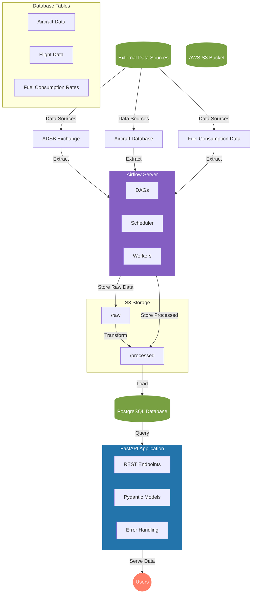

# System Architecture

## Component Details

### Data Sources
- **ADSB Exchange**: Real-time and historical flight data
- **Aircraft Database**: Aircraft registration and specifications
- **Fuel Consumption Data**: Aircraft type fuel consumption rates

### Airflow Server Components
- **DAGs**: 
  - `readsb_hist_dag.py`
  - `aircraft_db_dag.py`
  - `fuel_consumption_dag.py`
- **Scheduler**: Manages DAG execution
- **Workers**: Execute tasks

### Storage
- **S3 Bucket**:
  - Raw data storage
  - Processed data storage
- **PostgreSQL**:
  - Structured data storage
  - Optimized for querying

### API Application
- **Endpoints**:
  - `/api/s8/aircraft/`
  - `/api/s8/aircraft/{icao}/co2`
- **Features**:
  - Data validation
  - Error handling
  - Response formatting 